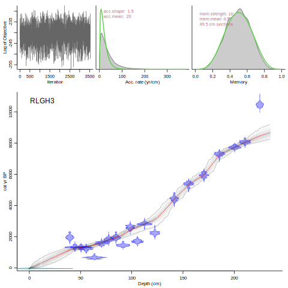
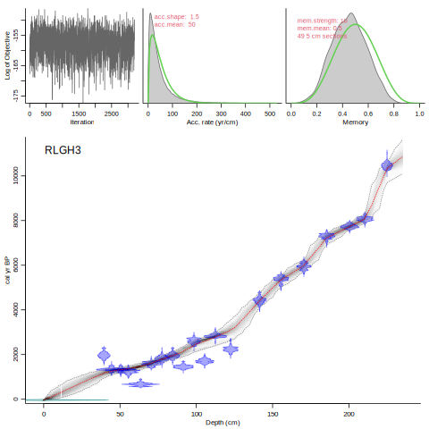
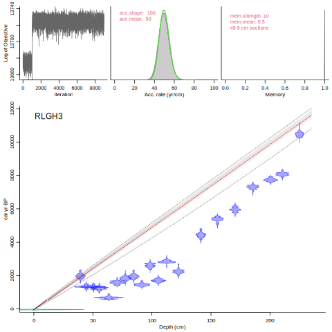
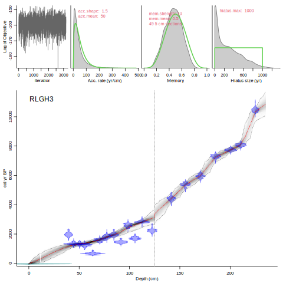
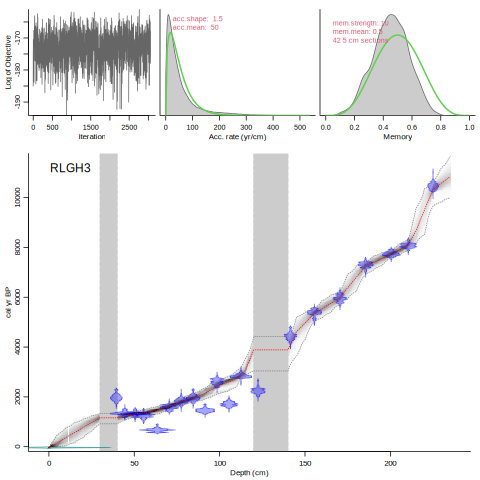

Another core that comes with rbacon is RLGH3 (Jones et al. 1989 J. Ecol 77: 1-23). This core has a lower dating density than MSB2K and also has a section where there appear to be outlying dates (or in other words, some of the dates don't seem to agree with other nearby dates). Since initial checks seem a slower accumulation rate (or rather, sedimentation time) than rbacon's default of 20 yr/cm, rbacon will ask if the prior should be changed to 50 yr/cm. For now, respond with `n` or `Enter`, so that the default, non-adapted settings will be used.

```{R, eval=FALSE}
Bacon('RLGH3')
```



Note that with the default settings, the age-model bypasses some of the younger dates between 130 and 60 cm core depth, since the older dates seem to fit better with the model and the dates further downcore and higher up the core. On top of this, the model bypasses the bottom date, because if the age-model were to go through this date, it would require large-scale changes in sedimentation times which seem to be prohibited by the default settings for the prior information. So let's run the model again, this time accepting the suggested default of 50 yr/cm for the accumulation rate (type `y` and press `Enter`):


```{R, eval=FALSE}
Bacon('RLGH3')
```



With the adapted prior for the accumulation rate, now the lowermost date *is* taken into account. Now, what if someone you trusted told you that they had some very strong information from other nearby lakes that sedimentation times are very likely to be 50 yr/cm? Then we can set the prior to be much more restrictive than the default - we let it peak higher so that the accumulation rates are 'forced' to values around 50 yr/cm:

```{R, eval=FALSE}
Bacon('RLGH3', acc.mean=50, acc.shape=100)
````



Bacon did what it was told to do. The posterior accumulation rates fit very well with the prior of 50 yr/cm. The age-depth model itself however is very straight and isn't very realistic, as most of the dates don't fit with the model. Note also the top-left panel which shows the MCMC run; the first thousand or so iterations are still sub-optimal and should really be removed using the `scissors` function. In all, not a good age-depth model, and it's probably a good idea to find another expert with more realistic prior information.

## memory

Besides the prior for accumulation rates, the other prior is that of the memory, and this defines how much accumulation rate can change from one core depth to another. To take an example, in the previous run the memory (rightmost top panel) is all the way at 1 or 100%. In other words, the accumulation rate at one depth is highly corrrelated with those at neighbouring depths. If you have a site where you have information about how constant the accumulation rate must have been (e.g., a riverine site could have had very episodical and varying accumulation), this can thus be included using the memory prior.

## hiatuses and slumps

If your site has hiatuses (gaps in accumulation), these can be set by providing their depths. By default, the maximum length of hiatuses is 10,000 years, but this can be adapted, for example:

```{r, eval=FALSE}
Bacon("RLGH3", acc.mean=50, hiatus.depths=125, hiatus.max=1000)
```



If your core had episodes of instantaneous sedimentation (e.g., visible tephra layers), they can be modelled too:

```{r, eval=FALSE}
Bacon("RLGH3", acc.mean=50, slump=c(180, 120, 40, 30))
```



## section thickness

The model underlying Bacon is made up of piece-wise linear sections, and for each section the accumulation rate is modelled as constrained by the priors for accumulation rate and memory. The sections, are 5 cm thick by default (`thick=5`). However, for very short cores this would result in a very elbowy model. For very long cores, the default section thickness could result in too many parameters and the model losing itself. Therefore, for very short or long cores, different values for will be suggested for `thick`.

Sometimes for difficult cores it can be a good idea to first run it with fewer, thicker sections in order to find useful combinations of priors and settings, and then running it again with more, thinner sections to obtain an age-depth model that looks 'smooth enough'. Each time, also check that the MCMC run looks fine and stable, and please check and show all panels of the age-model plot.

To see all options and settings, ask for help:

```{r, eval=FALSE}
?Bacon
```

and to see all options and settings for the age-model plot, type:

```{r, eval=FALSE}
?agedepth
```

***

[contents](./contents.html)
<br>
[<- previous [intro]](./intro.html)
<br>
[next [files and folders] ->](./foldersfiles.html)
